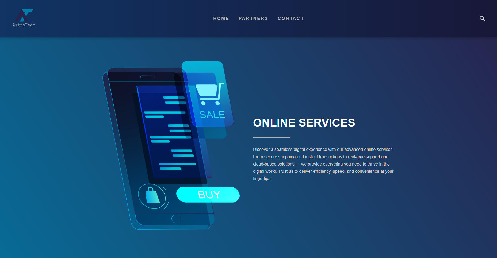
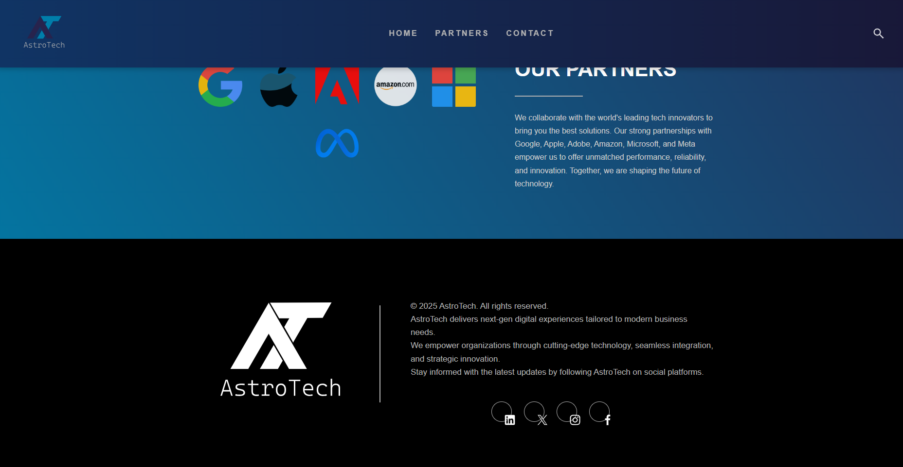

# AstroTech 🌌

A clean and responsive company landing page built using **HTML**, **CSS**, and **Bootstrap 5**.  
AstroTech highlights modern digital services, trusted partners, and contact information with a sleek and minimal design.

---

## 🚀 Features

- Fully responsive layout (desktop & mobile)
- Custom typography using **Sinkin Sans**
- Smooth, modern gradients and color palette
- Dedicated sections for:
  - **Online Services**
  - **Partners**
  - **Contact / Social Links**
- Lightweight — built with plain HTML, CSS, and minimal Bootstrap utilities

---

Screenshots (located in screenshots):

Home
----------------


Partners Section
----------------


---

## 🧩 Project Structure

```
AstroTech/
│
├── index.html          # Main landing page
├── styles.css          # Custom styles and layout rules
│
├── /images/            # Contains all logo and icon images
    ├── logo.svg
    ├── search.svg
    ├── linkedin.svg
    ├── x.svg
    ├── insta.svg
    ├── facebook.svg
    └── ... (partner logos)
```

---

## 🛠️ Technologies Used

- **HTML5** for structure  
- **CSS3** for styling
- **JavaScript (vanilla)** for small interactions (dropdown behavior)

---

## 💡 How to Use

1. Clone or download the project:
   ```bash
   git clone https://github.com/Ahmed-Al-Hemyari/astrotech.git
   ```
2. Open `index.html` in your browser.  
3. That’s it — no build tools or dependencies needed!

---

## 📱 Responsiveness

The layout automatically adapts for:
- Desktop screens (≥1200px)
- Tablets (600–900px)
- Mobile devices (≤380px)

---

## 📄 License

© 2025 **AstroTech**.  
This project is for demonstration and educational purposes.

---

Contact:

Author: Ahmed Al-Hemyari (https://github.com/Ahmed-Al-Hemyari)

Email: ahmed.a.alhemyari@gmail.com

---

Built with HTML, CSS, and JavaScript.
